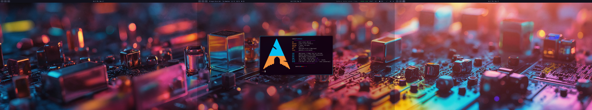

# dotfiles

Arch Linux + Hyprland on a triple 1080p setup. Managed with [GNU Stow](https://www.gnu.org/software/stow/).



## What's included

| Package | Description |
|---------|-------------|
| `hypr` | Hyprland, hypridle, hyprlock, hyprsunset |
| `waybar` | Status bar with custom modules (analytics, git activity, weather, GPU, idle guard) |
| `ghostty` | Terminal |
| `nvim` | Neovim (LazyVim) |
| `fuzzel` | App launcher |
| `mako` | Notifications |
| `fastfetch` | System info |
| `cwal` | Wallpaper-based color generation |
| `btop` | System monitor |
| `lazygit` | Git TUI |
| `tmux` | Terminal multiplexer |
| `fontconfig` | Font config |
| `swayosd` | Volume/brightness OSD |
| `scripts` | Utility scripts (`~/.local/bin`) |
| `systemd` | User services (idle guard, watchdog) |
| `zsh` | Shell config |
| `git` | Git config |

## Setup

```bash
git clone https://github.com/kloogans/dotfiles ~/dotfiles
cd ~/dotfiles

# Install everything
stow hypr waybar ghostty nvim fuzzel mako fastfetch cwal btop lazygit tmux fontconfig swayosd scripts systemd zsh git

# Or just what you want
stow waybar fuzzel
```

## Stack

- **WM:** Hyprland
- **Bar:** Waybar
- **Terminal:** Ghostty
- **Shell:** zsh
- **Editor:** Neovim (LazyVim) / Zed
- **Launcher:** Fuzzel
- **Notifications:** Mako
- **Theme:** Catppuccin Mocha
- **Font:** Iosevka Nerd Font / JetBrainsMono Nerd Font
